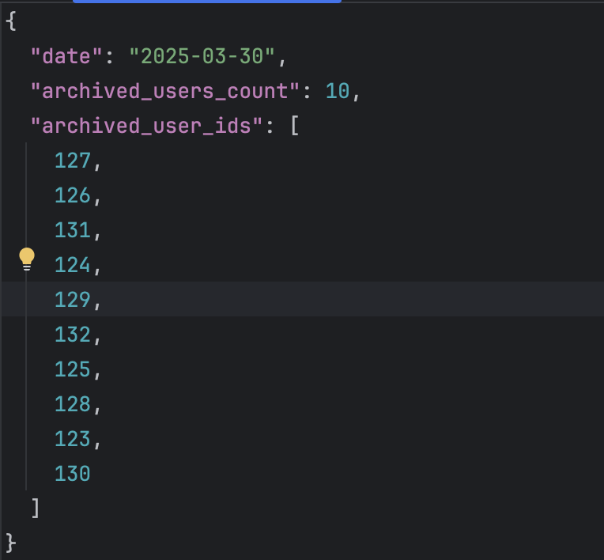

Итак, задача. Предварительно ознакомьтесь с доп. материалом - https://stepik.org/media/attachments/lesson/1934115/NoSQL_MongoDB.pdf

В базе данных MongoDB хранятся события пользователей в коллекции user_events. Каждый документ содержит информацию о пользователе и его действиях.

Вначале залейте данные в базу данных, чтобы было с чем работать. Напоминаю, что докер образ из начального степа этого раздела должен работать! Ниже код Python, поэтому вставляйте его в PyCharm.

from pymongo import MongoClient
from datetime import datetime

# Подключение к MongoDB
client = MongoClient("mongodb://localhost:27017/")
db = client["my_database"]
collection = db["user_events"]

# Список документов
data = [
    {
        "user_id": 123,
        "event_type": "purchase",
        "event_time": datetime(2024, 1, 20, 10, 0, 0),
        "user_info": {
            "email": "user1@example.com",
            "registration_date": datetime(2023, 12, 1, 10, 0, 0)
        }
    },
    {
        "user_id": 124,
        "event_type": "login",
        "event_time": datetime(2024, 1, 21, 9, 30, 0),
        "user_info": {
            "email": "user2@example.com",
            "registration_date": datetime(2023, 12, 2, 12, 0, 0)
        }
    },
    {
        "user_id": 125,
        "event_type": "signup",
        "event_time": datetime(2024, 1, 19, 14, 15, 0),
        "user_info": {
            "email": "user3@example.com",
            "registration_date": datetime(2023, 12, 3, 11, 45, 0)
        }
    },
    {
        "user_id": 126,
        "event_type": "purchase",
        "event_time": datetime(2024, 1, 20, 16, 0, 0),
        "user_info": {
            "email": "user4@example.com",
            "registration_date": datetime(2023, 12, 4, 9, 0, 0)
        }
    },
    {
        "user_id": 127,
        "event_type": "login",
        "event_time": datetime(2024, 1, 22, 10, 0, 0),
        "user_info": {
            "email": "user5@example.com",
            "registration_date": datetime(2023, 12, 5, 10, 0, 0)
        }
    },
    {
        "user_id": 128,
        "event_type": "signup",
        "event_time": datetime(2024, 1, 22, 11, 30, 0),
        "user_info": {
            "email": "user6@example.com",
            "registration_date": datetime(2023, 12, 6, 13, 0, 0)
        }
    },
    {
        "user_id": 129,
        "event_type": "purchase",
        "event_time": datetime(2024, 1, 23, 15, 0, 0),
        "user_info": {
            "email": "user7@example.com",
            "registration_date": datetime(2023, 12, 7, 8, 0, 0)
        }
    },
    {
        "user_id": 130,
        "event_type": "login",
        "event_time": datetime(2024, 1, 23, 16, 45, 0),
        "user_info": {
            "email": "user8@example.com",
            "registration_date": datetime(2023, 12, 8, 10, 0, 0)
        }
    },
    {
        "user_id": 131,
        "event_type": "purchase",
        "event_time": datetime(2024, 1, 24, 12, 0, 0),
        "user_info": {
            "email": "user9@example.com",
            "registration_date": datetime(2023, 12, 9, 14, 0, 0)
        }
    },
    {
        "user_id": 132,
        "event_type": "signup",
        "event_time": datetime(2024, 1, 24, 18, 30, 0),
        "user_info": {
            "email": "user10@example.com",
            "registration_date": datetime(2023, 12, 10, 10, 0, 0)
        }
    }
]

# Заливка данных в коллекцию
collection.insert_many(data)

print("✅ Данные успешно загружены в MongoDB")

                  
Далее задание. Требуется:

Ежедневно находить пользователей, которые:

Зарегистрировались более 30 дней назад

И не проявляли активности последние 14 дней

Перемещать этих пользователей в архивную коллекцию archived_users

Сохранять отчёт в формате .json о количестве пользователей, архивированных в этот день. Автоматизация через cron не нужна, запуск скрипта - ручной, ежедневный. Используйте только pymongo, json, os и datetime. Формат отчета - 

Критерии сдачи задания -

Есть JSON
Есть Python скрипт, который выполняет задачу по ТЗ
Название отчета формируется автоматически, исходя из даты - YYYY-MM-DD.json
Репозиторий оформлен корректно, находится только python скрипт, который производит архивацию. При наличии в репозитории скрипта INSERT задача считается не сданной.
P.S. На стажировке невозможно знать все, но возможно за сжатые сроки узнать очень много нового. Поэтому, если задание кажется Вам сложным - пропустите его и вернитесь к нему позже. А также не забывайте приходить на вебинар, ведь там это задание будет разобрано!