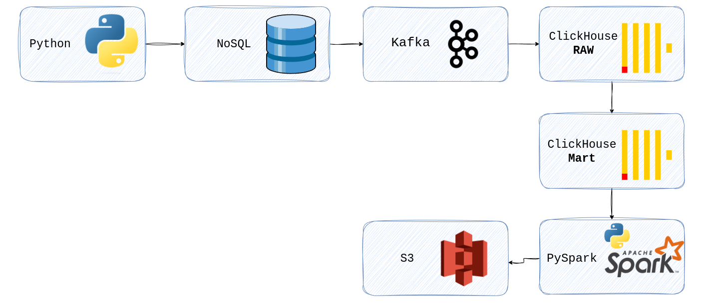

#### 🚀 Создание ETL Для аналитики сетевого магазина
Учебный проект реализует симуляцию транспортного pipeline для формирования аналитических витрин сетевого магазина Пикча.
#### 🛠️ Используемые технологии
🐳 Docker Compose
📊 ClickHouse (RAW/Mart слои)
🗄️ MongoDB
📡 Kafka (Producer/Consumer)
📈 Grafana + ClickHouse plugin
⚡ PySpark (Jupyter)
☁️ MinIO (S3 storage)
🤖 Telegram Bot alerting
🌬️ Airflow

Cхема pipeline:

#### 📋Подготовка и запуск Docker compose 
1. Склонируй проект к себе на хост
2. создай виртуальное окружение у себя в проекте
3. установи библиотеки из requirements.txt pip install -r requirements.txt
4. запусти Docker (см. Airflow_image)
5. Создай .env для переменных окружения

#### ETL Pipeline (по порядку!)
1. Генерация JSON данных python- 001_data_generator.py
2. Загрузка в MongoDB python- 002_json_to_mongo.py
3. Создание БД и таблиц в ClickHouse python- 003_generator_db_clickhouse.py
4. Запуск pipeline в Airflow
> ###### - Подключись: http://localhost:8080
> ###### - создай connection (см. Airflow_image)
> ###### - запусти DAG final_report

5. Настройка Grafana + Alerting
> ###### - Подключись: http://localhost:3000
> ###### - Plugin: grafana-clickhouse-datasource
> ###### - Telegram alerting (инструкции в инете)
> ###### - python 004_generator_alarm_grafana.py

8. Проверь отчет в MinIO
> ###### - Админка: http://localhost:9001
  
##### ✅ Критерии выполнения 
  
| ✓ Критерий                 | Статус | Доказательство                           |
| -------------------------- | ------ | ---------------------------------------- |
| Docker Compose с сервисами | ✅      | docker compose.yml                       |
| Генератор данных           | ✅      | 001_data_generator.py                    |
| Grafana дашборд            | ✅      | screenshots/grafana/                     |
| Telegram бот alerting      | ✅      | @alarm_grafana_test_bot                  |
| SQL MV для очистки         | ✅      | ddl/008_mv_mart_clean_purchases.sql      |
| Grafana Alerting           | ✅      | screenshots/alerts/                      |
| Отчет в MinIO              | ✅      | containers/minio-data/report-clickhouse/ |
| Создан DAG в Airflow       | ✅      | см. Airflow  (scren shots)               |
  
  

